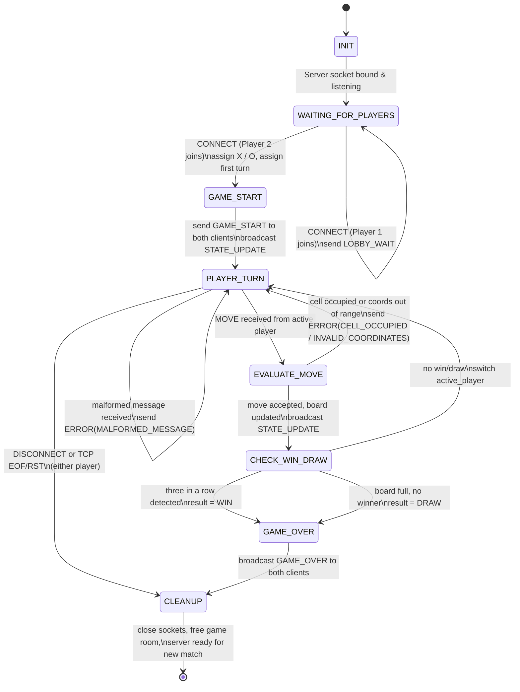

# Game Finite State Machine (FSM) Specification — Tic-Tac-Toe

This document defines the server-side state machine that governs the
lifecycle of a single Tic-Tac-Toe match, including turn handling, invalid
input, and client disconnection.

## 1. State Diagram (Mermaid `stateDiagram-v2`)



## 2. State Descriptions

| State | Description |
|---|---|
| `INIT` | Server process starts, binds and listens on the configured TCP port. |
| `WAITING_FOR_PLAYERS` | Server has 0 or 1 connected clients. First client receives `LOBBY_WAIT`. |
| `GAME_START` | Both clients connected. Server randomly assigns X/O, picks the first turn, and sends `GAME_START` to each client with their role. |
| `PLAYER_TURN` | Server is blocked waiting for a `MOVE` message from the client currently marked `active_player`. |
| `EVALUATE_MOVE` | Server validates the submitted move: in-range coordinates and an unoccupied cell. |
| `CHECK_WIN_DRAW` | Server checks the 8 possible win lines (3 rows, 3 columns, 2 diagonals) and whether the board is full. |
| `GAME_OVER` | A result has been determined (`WIN`, `DRAW`, or `FORFEIT`); final message is broadcast to both clients. |
| `CLEANUP` | Server closes both sockets, releases the game-room state, and returns to accept new connections. |

## 3. Turn Enforcement Logic

The server stores a single `active_player` field in its game-room state.
Every incoming `MOVE` is checked against this field **before** touching the
board:

```python
if message["player_id"] != game.active_player:
    send_error(sock, "OUT_OF_TURN", "It is not your turn.")
    return  # stay in PLAYER_TURN, no state change
```

Only a move from the currently active player is passed into `EVALUATE_MOVE`.

## 4. Invalid Move Handling

`EVALUATE_MOVE` rejects a move (returning the FSM to `PLAYER_TURN` without
switching the active player) when:
- `row` or `col` is outside `0-2`, or missing/non-integer → `INVALID_COORDINATES`
- The target cell is already `X` or `O` → `CELL_OCCUPIED`

The rejected player keeps their turn and may resubmit; this is why
`EVALUATE_MOVE --> PLAYER_TURN` does **not** advance `active_player`.

## 5. Disconnection Handling

A `DISCONNECT` message, a clean TCP EOF (`recv()` returns `b""`), or a socket
exception (`ConnectionResetError`, `BrokenPipeError`,
`ConnectionAbortedError`) at any point during `PLAYER_TURN` all route to the
same transition: `CLIENT_DISCONNECTED`, shown above as
`PLAYER_TURN --> CLEANUP`. Before fully cleaning up, the server:

1. Sends `GAME_OVER` with `result: "FORFEIT"` and `winner` set to the
   remaining connected player, if one is still connected.
2. Closes any remaining open socket for that game room.
3. Releases the room so `WAITING_FOR_PLAYERS` can accept a new pairing.

## 6. Post-Game Reset

After `CLEANUP`, the server returns to `[*]` → `INIT`/`WAITING_FOR_PLAYERS`
for the *room*, allowing a new pair of clients to connect and start a fresh
match without restarting the server process.
